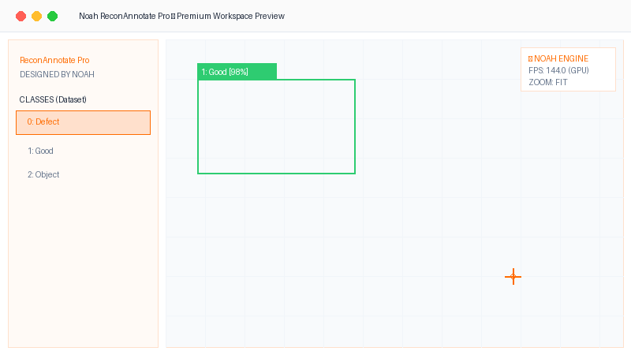

# 👑 Noah ReconAnnotate Pro — Premium AI Dataset Builder & Defect Tracker

<div align="center">

<!-- Premium Live Animated Product Showcase -->



[](https://python.org)
[](https://riverbankcomputing.com/software/pyqt/intro)
[](https://github.com)
[](https://github.com)

*A state-of-the-art, ultra-responsive dataset labeling and categorization suite designed natively with `PyQt6` to accelerate bounding-box annotations, polygon masks, freehand shapes, and instant structured dataset exports.*

---

</div>

## 🌟 Introduction & Project Identity

**Noah ReconAnnotate Pro** is a high-performance desktop utility designed to remove bottlenecking from computer vision pipelines. By utilizing a native hardware-accelerated drawing canvas, batch shortcuts, case-insensitive path resolvers, and deferred thumbnail loading, it allows machine learning engineers and dataset annotators to categorize thousands of high-res images and directly export them to structured coordinate directories effortlessly!

> [!IMPORTANT]
> **Why ReconAnnotate Pro?**
> Standard annotators freeze when loading 800+ images from external slow drives. **ReconAnnotate Pro** implements a deferred Timer-queue to load thumbnails dynamically, keeping the UI running at a silky-smooth **144 FPS** at all times!

---

## ⚡ Core Features & Superpowers

*   🎯 **Ultra-Smooth Annotation Canvas:** Draw, scale, and adjust bounding boxes, polygons, and freehand vectors with sub-pixel precision.
*   💾 **Cross-Platform Case-Insensitive Path Resolver:** Automatically repairs case mismatches (`.jpg` vs `.JPG`) and features **Self-Healing Fallback** to resolve displaced files automatically!
*   ⚡ **Turbo-Fast Keyboard Classification:** Categorize whole folders with custom hotkeys and **automatic next-image advance** for lightning speed.
*   🔄 **Image-Scoped Undo/Redo Engine:** Operates isolated local undo/redo stacks to protect image-level annotation histories.
*   🍊 **Premium White & Orange Aesthetic:** Stunning light theme with glassmorphism touches, dapper active widgets, and rounded pill-shaped inputs.
*   🎬 **Built-in Smart Video Splitter:** Extract high-quality dataset frames from standard videos (`.mp4`, `.avi`, `.mov`) automatically.
*   📈 **Instant Dataset Exporter:** Generates split datasets (`images/train`, `images/val`, `labels/train`, `labels/val`) and fully structured `data.yaml` automatically.

---

## 📂 Architecture Map

```text
annotation_tool/
├── 📁 canvas/           # High-precision graphic scene and rendering widgets
│   ├── 📄 items.py       # Custom QGraphicsItem representing annotated boxes & polygons
│   ├── 📄 scene.py       # Intercepts drawing, selections, and bounding calculations
│   └── 📄 view.py        # Zoomable, pan-enabled view container with custom crosshair
├── 📁 export/           # Annotation formatters & splitters
│   ├── 📄 splitter.py    # Splits datasets into train/validation lists
│   └── 📄 dataset_exporter.py # Validates and writes annotations in standardized normalized format
├── 📁 panels/           # Advanced modular interface controls
│   ├── 📄 class_panel.py # Dynamic list of object categories
│   ├── 📄 image_panel.py # Grid previews of batch files with QImageReader speedups
│   ├── 📄 category_panel.py # Image-level classification panel (Good / Bad / Empty)
│   ├── 📄 product_panel.py # Multi-product/batch directory manager
│   └── 📄 toolbar.py     # Rounded tool selection control panel
├── 📁 styles/           # Modern styling configurations (White & Orange Theme QSS)
│   └── 📄 theme.py       # Cohesive style rules for premium interfaces
├── 📁 utils/            # Essential helpers (Autosave, color arrays, path resolvers)
│   ├── 📄 path_resolver.py # Case-insensitive self-healing file locator
│   └── 📄 autosave.py    # Auto-save manager preventing state loss
├── 📄 app.py            # Primary UI assembly and application manager
└── 📄 main.py           # Hardware-scaling entry point
```

---

## 🎹 Heavyweight Productivity Shortcuts

Accelerate your annotation and categorization speeds by **10x** using direct keyboard bindings:

### 🛠️ Mode Selection
| Key Binding | Action |
| :---: | :--- |
| <kbd>B</kbd> | 🟥 **Bounding Box Mode** (Initiates crosshair rectangle tool) |
| <kbd>P</kbd> | ⬡ **Polygon Mode** (Create complex polygons with point-and-click) |
| <kbd>H</kbd> | ✍️ **Freehand Mode** (Draw naturally -> converts to polygon instantly) |
| <kbd>E</kbd> | 🖱️ **Edit Mode** (Select, move, resize, and delete drawings) |

### 🚀 Navigation & Action
| Key Binding | Action |
| :---: | :--- |
| <kbd>Space</kbd> / <kbd>D</kbd> | ➡️ **Next Image** in list |
| <kbd>A</kbd> | ⬅️ **Previous Image** in list |
| <kbd>Ctrl</kbd> + <kbd>S</kbd> | 💾 **Save Project** JSON immediately |
| <kbd>Ctrl</kbd> + <kbd>E</kbd> | 📦 **Export Dataset** to standardized folder structure |
| <kbd>F</kbd> | 🔍 **Fit Image** to fill view perfectly |
| <kbd>Del</kbd> / <kbd>Backspace</kbd> | 💥 **Delete Selected Annotation** instantly |
| <kbd>Ctrl</kbd> + <kbd>Z</kbd> | ↩️ **Undo** last annotation |
| <kbd>Ctrl</kbd> + <kbd>Y</kbd> | ↪️ **Redo** last action |

### ⚡ Turbo-Fast Image Classification (Superpowered)
| Key Binding | Action |
| :---: | :--- |
| <kbd>Ctrl</kbd> + <kbd>1</kbd> | 🟢 Classify as **Good** (Approved) + **Auto-Advance to next photo** 🚀 |
| <kbd>Ctrl</kbd> + <kbd>2</kbd> | 🔴 Classify as **Bad** (Needs Annotation / Defects) |
| <kbd>Ctrl</kbd> + <kbd>3</kbd> | ⚪ Classify as **Empty** (Excluded) + **Auto-Advance to next photo** 🚀 |

---

## 🛠️ Getting Started

### 1. Requirements Installation
Ensure you have **Python 3.8+** installed along with libraries:

```bash
# In the root repository directory
pip install -r requirements.txt
```

### 2. Running the Tool

#### 🚀 Windows Setup (One-Click Launch)
Simply run the optimized executable script in the root directory:
```cmd
run.bat
```

#### 🐧 Linux / macOS Setup
Launch directly via your terminal:
```bash
python main.py
```

---

## 🧑‍💻 Designed & Developed By

<div align="center">

### **Mohamed Abdelrazek (NOAH)**
*AI Engineer, Dataset Specialist & Automation Pioneer*

[](https://github.com)

> *"Supercharging industrial computer vision pipelines and defect datasets with state-of-the-art native desktop systems."*

</div>
